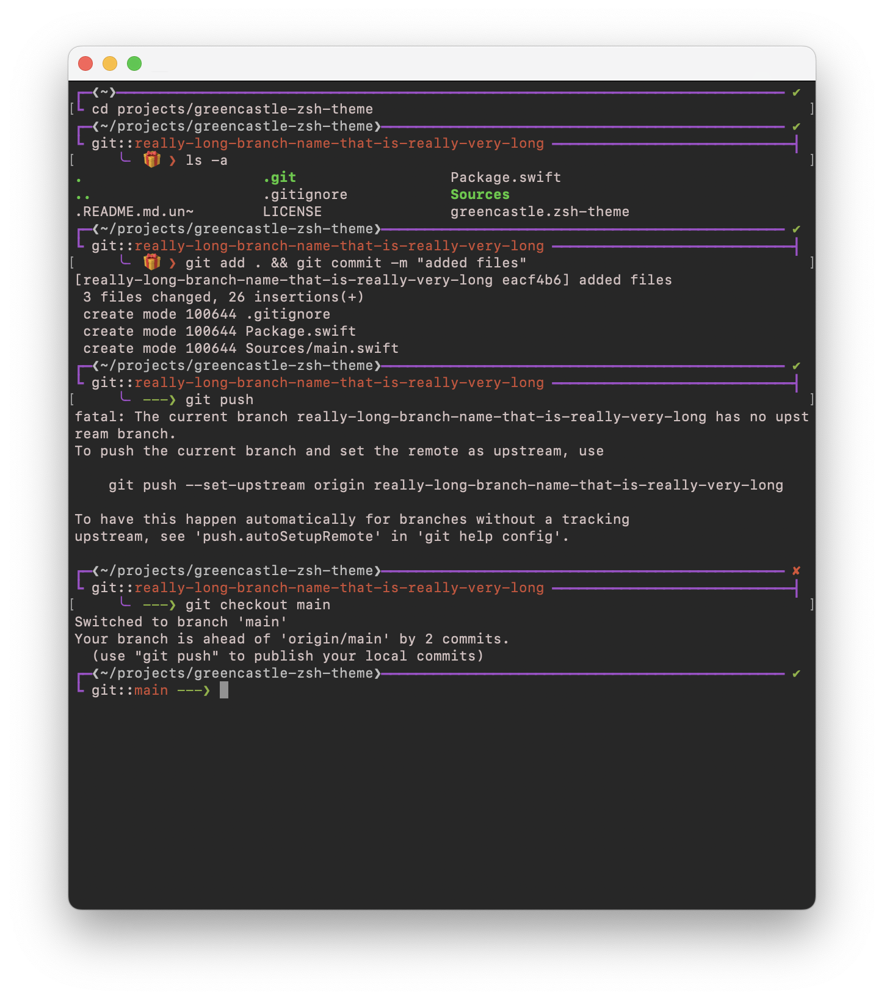

## Green Castle zsh-theme
A minimalistic theme, that supports really, **really**, long branch names,
without severely truncating the prompt. The theme is inspired by the [jonathan
theme](https://github.com/thlorenz/oh-my-zsh/blob/master/themes/jonathan.zsh-theme)
and the [robby russel
theme](https://github.com/thlorenz/oh-my-zsh/blob/master/themes/robbyrussell.zsh-theme).

